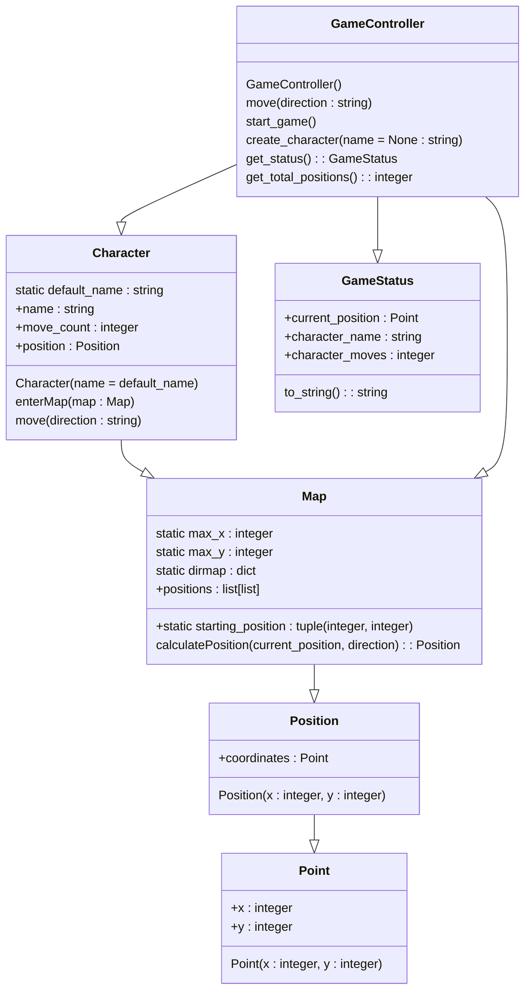

# Design Class Diagram

```mermaid
classDiagram
    class Character{
        static default_name : string
        +name : string
        +move_count : integer
        +position : Position

        Character(name = default_name)
        enterMap(map : Map)
        move(direction : string)

    }
    class Map{
        +static starting_position : tuple(integer, integer)
        static max_x : integer
        static max_y : integer
        static dirmap : dict
        +positions : list[list]

        calculatePosition(current_position, direction) : Position
    }
    Character --|> Map

    class Position {
        +coordinates : Point

        Position(x : integer, y : integer)
    }
    Map --|> Position

    class Point {
        +x : integer
        +y : integer
        Point (x : integer, y : integer)
    }
    Position --|> Point

    class GameController{

        GameController()
        move(direction : string)
        start_game()
        create_character(name = None : string)
        get_status() : GameStatus
        get_total_positions() : integer
    }

    GameController --|> Character
    GameController --|> Map
    GameController --|> GameStatus

    class GameStatus{
        +current_position : Point
        +character_name : string
        +character_moves : integer
        to_string() : string
    }

```
